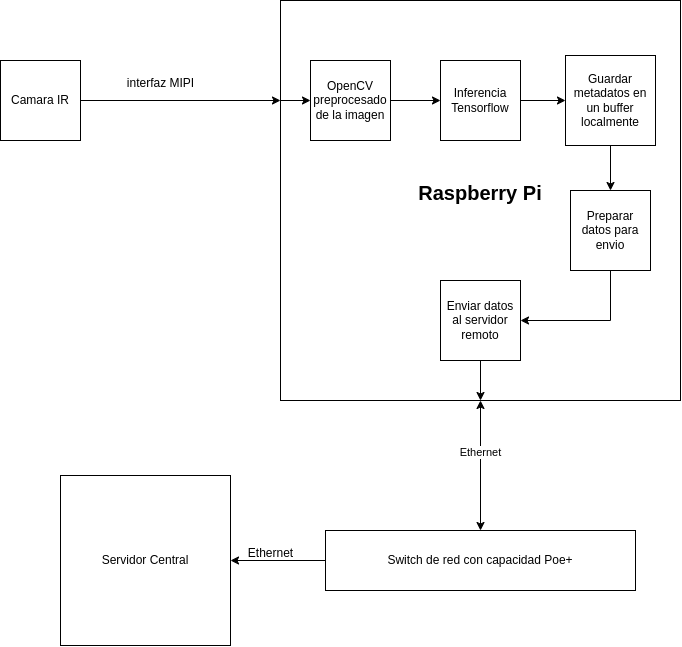

# Propuesta de diseño

##  Justificación del proyecto y revisión bibliográfica
El análisis emocional del público durante una proyección cinematográfica es una herramienta vde recolección de información importante para evaluar el impacto narrativo, la eficacia de escenas clave y la experiencia general del espectador. Sin embargo, los métodos tradicionales como encuestas o entrevistas presentan limitaciones significativas como estár sujetos a sesgos conscientes o inconscientes, carecer de correlación temporal precisa entre el estímulo y la respuesta emocional, y no capturar reacciones espontáneas.

Ante esta problemática, el desarrollo de un sistema no intrusivo de análisis facial automático capaz de detectar y clasificar, en tiempo real y con alta precisión, las emociones de los espectadores durante una función de cine adquiere gran relevancia. Además, el sistema está diseñado como una red de nodos autónomos, lo que garantiza escalabilidad, modularidad y recolección eficiente de datos sin afectar la experiencia del espectador. 

En consecuencia, este proyecto no solo responde a una necesidad tecnológica emergente, sino que también representa una innovación sustancial en la forma en que se estudia la interacción entre el espectador y el medio audiovisual.

## Descripción y síntesis del problema

El problema radica en la necesidad de realizar analisis de manera objetiva y cuantificable de las emociones que se generan en los espectadores durante una pelicula en una sala de cine. Debido a que los métodos tradicionales como las encuestas presentan limitaciones significativas como lo puede ser el sesgo, falta de correlación temporal entre las emociones y el estímulo, y la incapacidad de capturar reacciones espontaneas y no verbalizadas.

Entonces en este proyecto se busca capturar, analizar y clasificar de forma no intrusiva las emociones, en tiempo real y con alta precisión, las expresiones faciales de los espectadores en la sala de cine durante la función. Ademas que el sistema funcione en una red de nodos que permita recolectar los datos a un servidor central.


## Gestión de los requerimientos
### Esquema de Codificación de Requerimientos

- Prefijo RF: Requerimiento Funcional
- Prefijo RNF: Requerimiento No Funcional

Sufijo Categoría:

- CAP: Captura de imágenes
- PRO: Procesamiento
- CLA: Clasificación
- ALM: Almacenamiento
- COM: Comunicación
- SEG: Seguridad
- REN: Rendimiento
- USE: Usabilidad
## Tabla de requerimientos principales para el proyecto

| ID | Categoría | Descripción | Criterio de Aceptación | Prioridad |
|---|----------|------------|----------------------|---------|
| RF-CAP-01 | Captura | Sistema captura imágenes faciales en baja luz | Captura en ≤ 5 lux | Alta |
| RF-CAP-02 | Captura | Captura no intrusiva, camuflada en asientos | Sin interferencia visible | Alta |
| RF-PRO-01 | Procesamiento | Detección de rostros en imágenes | Precisión ≥ 90% | Alta |
| RF-CLA-01 | Clasificación | Clasificar 6 emociones básicas | Enojo, disgusto, miedo, felicidad, tristeza, sorpresa | Alta |
| RF-CLA-02 | Clasificación | Procesamiento local (Edge AI) | Sin envío externo de imágenes | Alta |
| RF-ALM-01 | Almacenamiento | Registro con marca temporal | Precisión ≤ 100ms | Alta |
| RF-COM-01 | Comunicación | Acceso remoto para configuración y además permitir transferencia de metadatos para su posterior análisis | Conexion remota por medio de SSH y capacidad para conectarse a una base de datos | Media |
| RNF-HW-01 | Hardware | Implementación en Raspberry Pi | RPi con mín. 4GB RAM | Alta |
| RNF-REN-01 | Rendimiento | Baja latencia de procesamiento | ≤ 300ms captura-clasificación | Alta |
| RNF-SEG-01 | Seguridad | No almacenar imágenes originales | Solo metadatos | Alta |
| RNF-USE-01 | Usabilidad | Operación autónoma | ≥ 8 horas sin intervención | Alta |
| RNF-DEP-01 | Dependencias | Yocto Project y TensorFlow Lite | Imagen Linux personalizada | Alta |

# Requerimientos especificos

| ID | Descripción | Criterio de Aceptación | Prioridad |
|---|------------|----------------------|---------|
| RNF-HW-01 | Utilizar Raspberry Pi como unidad central de procesamiento | Capacidad suficiente para realizar la inferencia con poca latencia > 300ms | Alta |
| RNF-HW-02 | Cámara con sensibilidad infrarroja para captura en baja luz | Tener sensibilidad a la luz infrarroja | Alta |
| RNF-HW-03 | Iluminador IR discreto para mejorar captura en oscuridad | LED IR 850nm con difusor, invisible al ojo humano | Media |
| RNF-HW-04 | Sistema de alimentación PoE (Power over Ethernet) | Estándar IEEE 802.3at (PoE+) con protección sobrecarga | Alta |
| RNF-HW-05 | Disipación térmica pasiva (sin ventiladores) | Temperatura máxima en operación ≤ 65°C | Alta |
| RNF-HW-06 | Carcasa integrable en respaldar de asiento de cine | Dimensiones máximas: 10cm × 8cm × 3cm | Alta |
| RNF-HW-07 | Material de carcasa no reflectante | Acabado mate con coeficiente reflexión < 10% | Media |
| RNF-HW-08 | Almacenamiento local para sistema operativo y datos | SSD M.2 o microSD Clase 10 UHS-I con mín. 32GB | Alta |
| RNF-HW-10 | Posicionamiento ajustable de cámara | Rango ajuste vertical: ±20°, horizontal: ±15° | Media |
| RNF-HW-11 | Consumo energético en operación continua | Máximo 15W promedio, pico 25W | Alta |
| RNF-HW-13 | Indicadores LED de estado operativo | 3 LEDs mínimo: encendido, procesamiento, error | Baja |
| RNF-HW-14 | Botón físico para reinicio seguro | Accesible pero protegido contra activación accidental | Media |
| RNF-HW-18 | Sistema de montaje seguro y removible | Soportar 5kg de fuerza sin desprenderse | Alta |


## Vista operacional del sistema

La vista operacional del sistema describe cómo se comporta el sistema en su entorno real, es decir, dentro de una sala de cine, considerando su funcionamiento diario, su mantenimiento y su proceso de instalación:

1. Operación
   
   El sistema opera de forma autónoma durante la proyección de la película, ejecutando las siguientes funciones:

      1.1 Captura continua de imágenes faciales mediante cámaras infrarrojas camufladas en los respaldos de los asientos.

      1.2 Procesamiento local en dispositivos Raspberry Pi 5, donde se detectan rostros y se clasifican emociones en tiempo real.

      1.3 Generación y almacenamiento de metadatos (emoción, tiempo, ubicación) con marcas temporales precisas y sin almacenar imágenes originales, garantizando la privacidad.

      1.4 Transmisión de metadatos al servidor central, donde se pueden consolidar, analizar y visualizar los resultados de múltiples nodos.

2. Mantenimiento
   
   Para garantizar un funcionamiento estable y continuo del sistema, se contempla:

      2.1 Monitoreo remoto de cada nodo a través de SSH, lo que permite actualizaciones, reinicios o diagnósticos sin intervención física.

      2.2 Indicadores LED de estado en cada unidad para facilitar la identificación de errores o fallas en campo.

      2.3 Reinicio seguro mediante botón físico, útil en casos de congelamiento o mal funcionamiento local.

      2.4 Verificación periódica de temperatura y rendimiento para prevenir sobrecalentamientos o fallos por exceso de carga.

3. Instalación
   
   El proceso de instalación inicial considera:

      3.1 Montaje físico de los nodos en los respaldos de los asientos, usando estructuras removibles que soportan al menos 5 kg de fuerza.

      3.2 Ajuste óptico de cámaras, con mecanismos de inclinación vertical y horizontal para adaptar el ángulo de captura según la geometría de la sala.

      3.3 Configuración de red PoE (Power over Ethernet), que simplifica la alimentación eléctrica y la conectividad con un solo cable.

      3.4 Calibración del sistema en función de las condiciones lumínicas reales del cine y validación de la precisión de los modelos con datos de prueba.

## Vista funcional del sistema

La vista funcional del sistema representa los componentes principales del sistema y cómo interactúan entre sí para cumplir con el objetivo de capturar y analizar las emociones del público durante una función de cine. Esta vista se centra en qué hace el sistema y cómo fluye la información entre los módulos.

1. Captura de imágenes
   
   El sistema inicia con cámaras infrarrojas instaladas en los respaldos de los asientos.

   Estas cámaras están diseñadas para capturar rostros en condiciones de baja luz, típicas de una sala de cine.

2. Procesamiento local en el nodo
   
   Cada cámara está conectada a una unidad de procesamiento local (Raspberry Pi 5) que ejecuta una imagen de Linux embebida (Yocto).

   En esta etapa se realiza:

      -Detección de rostros usando OpenCV.

      -Preprocesamiento de imágenes (recorte, normalización, etc.).

      -Inferencia con TensorFlow Lite para identificar la emoción expresada.

3. Clasificación emocional
   
   El modelo identifica una de las seis emociones básicas (felicidad, tristeza, enojo, miedo, sorpresa, disgusto) por cada rostro detectado.

   Cada resultado es empaquetado como un metadato emocional con sello de tiempo y ubicación del nodo.

4. Almacenamiento y envío de datos
   
   No se almacenan imágenes. Solo se guardan y/o transmiten los metadatos resultantes.

   Los datos se envían al servidor central mediante red local (Ethernet con PoE) para análisis posterior.

5. Configuración y monitoreo

   Todo el sistema puede ser configurado y monitoreado de forma remota, permitiendo cambios en parámetros como tasa de muestreo, actualización del modelo, etc.

   Esto habilita un control eficiente sin requerir intervención física constante.

## Arquitectura del sistema propuesto

### Diagrama del sistema:



## Análisis de dependencias

### Meta-layers necesarias a nivel de yocto:
- meta-poky: Capa base de Yocto Project con funcionalidad esencial
- meta-raspberrypi: Agrega soporte para la Raspberry Pi 5
- meta-openembedded/meta-oe: Proporciona componentes adicionales para sistemas embebidos
- meta-openembedded/meta-networking: Agrega soporte para las conexiones a internet
- meta-openembedded/meta-python: Agrega soporte básico para Python
- meta-openembedded/meta-multimedia: Proporciona soporte para cámaras y procesamiento multimedia
- meta-tensorflow-lite: Agrega soporte para TensorFlow Lite y sus dependencias
- meta-opencv: Proporciona soporte para OpenCV y bibliotecas de visión por computador
- meta-facial-detection (capa personalizada): Capa propia para la aplicación de análisis facial

### Árbol de dependencias:
```
meta-facial-detection
├── meta-opencv
│   └── meta-openembedded/meta-multimedia
├── meta-tensorflow-lite
│   ├── meta-openembedded/meta-python
│   └── meta-openembedded/meta-oe
├── meta-raspberrypi
│   └── meta-poky
├── meta-openembedded/meta-networking
└── meta-poky
```

## Estrategia de integración de la solución

Vamos a adoptar una metodología de integración incremental y basada en componentes, siguiendo estos principios:

- Desarrollo modular: cada componente se desarrolla y prueba independientemente.

- Integración progresiva: Comenzando por componentes básicos hacia sistemas complejos.

- Verificación continua: Cada paso de integración incluye pruebas funcionales.

- Enfoque bottom-up: Construyendo desde el hardware básico hasta la aplicación completa

### Fases de Integración Hardware-Software


Fase 1: Preparación de la Plataforma Base

- Configuración de la Raspberry Pi con sistema operativo temporal para desarrollo
- Preparación del entorno Yocto y configuración de capas base
- Pruebas iniciales de conexión con cámara IR y verificación de funcionamiento básico

Fase 2: Desarrollo del Sistema Operativo Embebido

- Compilación de imagen Yocto personalizada con dependencias esenciales
- Integración de drivers optimizados para cámara y hardware específico
- Pruebas de arranque y estabilidad del sistema operativo base

Fase 3: Implementación de Componentes de Software

- Integración de OpenCV y bibliotecas de procesamiento de imágenes
- Implementación de TensorFlow Lite y modelos de clasificación emocional
- Desarrollo de interfaces de comunicación y almacenamiento local

Fase 4: Integración Hardware Completa

- Integración de componentes ópticos (iluminación IR, filtros) con el sistema de cámara

Fase 5: Integración y Pruebas del Sistema Completo

- Ensamblaje final de unidades de hardware con software
- Configuración de red entre nodos y servidor central
- Pruebas integrales del sistema en entorno simulado

### Diagrama de Integración del Sistema
```
                  ┌─────────────────────────────────────┐
                  │  PROCESO DE INTEGRACIÓN DEL SISTEMA │
                  └─────────────────────────────────────┘
                                   │
     ┌────────────────────┬────────┴───────────┬─────────────────────┐
     ▼                    ▼                    ▼                     ▼
┌──────────┐      ┌───────────────┐    ┌─────────────┐      ┌──────────────┐
│ HARDWARE │      │ SISTEMA       │    │ SOFTWARE    │      │ DESPLIEGUE   │
│ BASE     │      │ OPERATIVO     │    │ APLICATIVO  │      │ Y PRUEBAS    │
└──────────┘      └───────────────┘    └─────────────┘      └──────────────┘
     │                    │                    │                     │
     ▼                    ▼                    ▼                     ▼
┌──────────┐      ┌───────────────┐    ┌─────────────┐      ┌──────────────┐
│• RPi 5   │      │• Yocto Linux  │    │• OpenCV     │      │• Integración │
│• Cámara  │─────►│• Drivers      │───►│• TensorFlow │─────►│  física      │
│• PoE HAT │      │• Boot config  │    │• APIs       │      │• Calibración │
└──────────┘      └───────────────┘    └─────────────┘      └──────────────┘
```

### Estrategias de Prueba y Verificación
Para cada fase de integración, implementaremos las siguientes estrategias de verificación:

- Pruebas unitarias: Verificación de cada componente individual

    - Prueba de cámara y captura de imagen
    - Verificación de detección de emociones
    - Evaluación de la precisión de clasificación emocional


- Pruebas de integración: Verificación de la interacción entre componentes

    - Pipeline completo desde captura hasta clasificación
    - Comunicación entre nodos y servidor
    - Gestión de recursos del sistema


- Pruebas de sistema: Verificación del sistema completo

    - Operación en condiciones simuladas de sala de cine
    - Pruebas de carga con múltiples nodos
    - Escenarios de recuperación ante fallos

### Plan de Despliegue Final

- Instalación física:

    - Montaje de nodos en respaldares de asientos


- Configuración y calibración:

    - Ajuste de parámetros de captura según condiciones de iluminación
    - Calibración de modelos para población específica
    - Sincronización de toda la red de nodos


- Validación operativa:

    - Prueba piloto con grupo reducido de asientos
    - Monitoreo de rendimiento y precisión
    - Recopilación de retroalimentación para ajustes

## Planeamiento de la ejecución

Fase 1: Preparación del Entorno de Desarrollo
Actividades:

Selección de hardware (RPi 5, cámaras IR, PoE, disipadores, carcasa).

Configuración inicial de Raspberry Pi con sistema operativo de desarrollo.

Instalación de herramientas necesarias: compilador Yocto, SDKs, Git, etc.

Clonación y organización de las meta-layers Yocto necesarias.

Fase 2: Desarrollo del Sistema Operativo Embebido
Duración estimada: 3 semanas
Actividades:

Personalización de la imagen Yocto para Raspberry Pi.

Integración de meta-layers: meta-raspberrypi, meta-tensorflow-lite, meta-opencv, etc.

Soporte para drivers de cámara IR y comunicación por red.

Validación del arranque y estabilidad del sistema.

Entregables:

Imagen Linux personalizada y funcional para el hardware objetivo.

Fase 3: Desarrollo e Integración de Componentes de Software
Duración estimada: 4 semanas
Actividades:

Implementación de la detección de rostros con OpenCV.

Integración de modelo de clasificación emocional en TensorFlow Lite.

Codificación de lógica de captura y etiquetado de metadatos.

Desarrollo de interfaces de comunicación remota (SSH, base de datos).

Pruebas de inferencia en condiciones controladas.

Entregables:

Software de análisis facial funcional en nodo.

Módulo de comunicación de metadatos al servidor central.

Fase 4: Integración Hardware y Ajustes Ópticos
Duración estimada: 2 semanas
Actividades:

Ensamblaje de carcasa, cámara, iluminación IR y disipadores.

Instalación en respaldos de asientos simulados o reales.

Ajuste de ángulos de cámara y calibración inicial.

Validación de condiciones térmicas y consumo eléctrico.

Entregables:

Nodos integrados físicamente, listos para despliegue.

Fase 5: Validación y Pruebas del Sistema Completo
Duración estimada: 3 semanas
Actividades:

Pruebas en entorno simulado de cine (condiciones reales de luz y sonido).

Validación de precisión de emociones detectadas.

Pruebas de red entre múltiples nodos y servidor.

Evaluación de latencia y estabilidad durante operación continua.

Entregables:

Informe de pruebas funcionales.

Ajustes finales según retroalimentación.

Fase 6: Despliegue Piloto
Duración estimada: 2 semanas
Actividades:

Instalación en una sección limitada de una sala de cine real.

Operación del sistema durante funciones reales.

Recolección de datos y retroalimentación.

Correcciones menores en software o hardware.

Entregables:

Validación operativa en entorno real.

Plan de escalado a mayor número de nodos.


## Conclusiones
